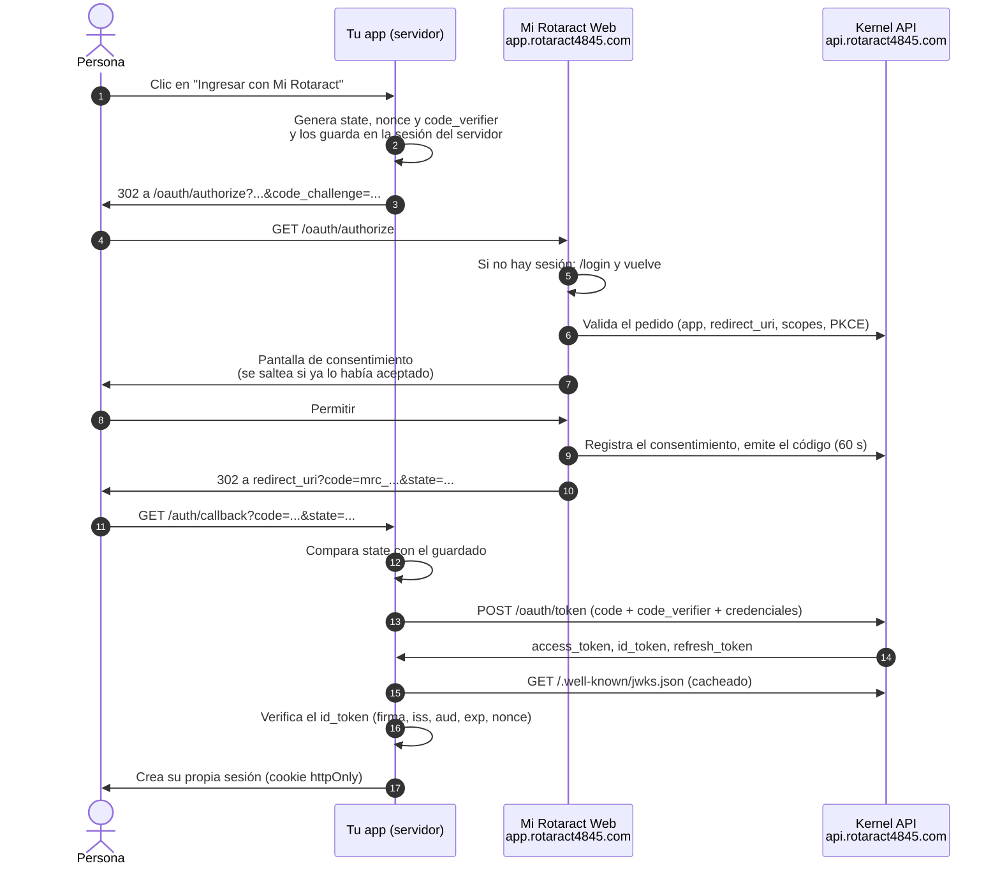

# Ingresar con Mi Rotaract

Permití que las personas inicien sesión en tu app con su cuenta de Mi
Rotaract. Usamos los estándares **OAuth 2.0 authorization code con PKCE** y
**OpenID Connect (OIDC)**, así que sirve cualquier librería OIDC seria.

- **PKCE** (Proof Key for Code Exchange): tu app inventa un valor secreto por
  cada intento de ingreso (`code_verifier`) y manda solo su huella
  (`code_challenge`). Así, un código robado no sirve sin el verificador.
  Es **obligatorio**, también para apps de servidor, y solo se acepta el
  método `S256`.
- **`id_token`**: un JWT firmado que dice quién ingresó y los datos que la
  persona aceptó compartir. Tu app lo **verifica** con las claves públicas
  del kernel.

Requisitos: una app con "Permitir que las personas ingresen con Mi Rotaract"
y tus direcciones de regreso registradas (ver
[registrar-una-app.md](registrar-una-app.md)).

## Datos de configuración

| Qué | Valor |
|---|---|
| `issuer` | `https://api.rotaract4845.com/api/kernel/v1` |
| Discovery | `{issuer}/.well-known/openid-configuration` |
| `authorization_endpoint` | `https://app.rotaract4845.com/oauth/authorize` |
| `token_endpoint` | `{issuer}/oauth/token` |
| `userinfo_endpoint` | `{issuer}/oauth/userinfo` |
| `revocation_endpoint` | `{issuer}/oauth/revoke` |
| `jwks_uri` | `{issuer}/.well-known/jwks.json` |
| Firma | `ES256` |
| Autenticación del cliente | `client_secret_basic`, `client_secret_post`, `none` (apps `PUBLIC`) |
| PKCE | `S256` |

Con una librería OIDC alcanza con darle el `issuer`: el resto lo lee del
discovery.

## El flujo



## Paso 1 · Preparar el pedido

Por cada intento de ingreso generá, del lado del servidor:

| Valor | Cómo | Para qué |
|---|---|---|
| `state` | Aleatorio, ≥ 128 bits. | Que la respuesta corresponda a un pedido tuyo (protege contra CSRF). |
| `nonce` | Aleatorio, ≥ 128 bits. | Que el `id_token` corresponda a este ingreso (protege contra replay). |
| `code_verifier` | 43 a 128 caracteres base64url. 32 bytes aleatorios dan 43. | PKCE. |
| `code_challenge` | `base64url(sha256(code_verifier))`, sin `=`. | PKCE. Es lo único que viaja en la URL. |

Guardá `state`, `nonce` y `code_verifier` **en la sesión del servidor**
(o en una cookie cifrada y `httpOnly`), nunca en `localStorage`.

## Paso 2 · Redirigir a Mi Rotaract

```text
https://app.rotaract4845.com/oauth/authorize
  ?response_type=code
  &client_id=mra_3f9c2a7b1e4d8c6a0b5f
  &redirect_uri=https%3A%2F%2Fasistencia.asuncioncentro.org.py%2Fauth%2Fcallback
  &scope=openid%20profile%20email%20memberships
  &state=Zk3x9QpL2vR8tY1wB6nM4cJ7
  &nonce=hT5gW2kP9sD4fQ8zL1xV3bN6
  &code_challenge=E9Melhoa2OwvFrEMTJguCHaoeK1t8URWbuGJSstw-cM
  &code_challenge_method=S256
```

| Parámetro | Obligatorio | Valor |
|---|---|---|
| `response_type` | Sí | `code` |
| `client_id` | Sí | Tu `client_id`. |
| `redirect_uri` | Sí | Una de las registradas, **idéntica** carácter por carácter. |
| `scope` | Sí | Separados por espacio. Tiene que incluir `openid` y solo scopes OIDC habilitados para tu app. |
| `code_challenge` | Sí | 43 a 128 caracteres base64url. |
| `code_challenge_method` | Sí | `S256` (`plain` se rechaza). |
| `state` | Recomendado (tratalo como obligatorio) | Lo devolvemos tal cual. |
| `nonce` | Recomendado (tratalo como obligatorio) | Lo ponemos en el `id_token`. |

Si el pedido es inválido (app inexistente o pausada, `redirect_uri` no
registrada, falta `openid`, scope no habilitado, PKCE incorrecto), Mi
Rotaract **muestra el error en su propia página y no redirige** a tu app. Es
a propósito: nunca mandamos a nadie a una dirección no registrada.

## Paso 3 · La persona decide

Mi Rotaract pide iniciar sesión si hace falta y muestra el consentimiento:
el nombre y la descripción de tu app, su organización y los datos pedidos con
su etiqueta (ver [conceptos.md](conceptos.md#scopes)). Botones **Permitir** y
**Cancelar**.

Si la persona ya había aceptado esos scopes, se saltea la pantalla y vuelve
directo a tu app.

**Permitir** vuelve a tu `redirect_uri` con el código:

```text
https://asistencia.asuncioncentro.org.py/auth/callback?code=mrc_Qk1v...&state=Zk3x9QpL2vR8tY1wB6nM4cJ7
```

**Cancelar** vuelve con un error:

```text
https://asistencia.asuncioncentro.org.py/auth/callback?error=access_denied&state=Zk3x9QpL2vR8tY1wB6nM4cJ7
```

Si tu `redirect_uri` ya tiene parámetros de consulta, se conservan y se
agregan estos.

## Paso 4 · Canjear el código

En tu callback:

1. Si vino `error=access_denied`: la persona canceló. Mostrale un mensaje
   amable y la opción de reintentar. No es un fallo.
2. Compará `state` con el guardado en la sesión. Si no coincide o no hay
   uno guardado, **cortá** (posible CSRF).
3. Canjeá el código **enseguida**: vence a los **60 segundos** y sirve **una
   sola vez**.

```bash
curl -s -X POST "$API/oauth/token" \
  -u "$MIROTARACT_CLIENT_ID:$MIROTARACT_CLIENT_SECRET" \
  -d grant_type=authorization_code \
  -d code="mrc_Qk1v..." \
  --data-urlencode redirect_uri="https://asistencia.asuncioncentro.org.py/auth/callback" \
  -d code_verifier="dBjftJeZ4CVP-mB92K27uhbUJU1p1r_wW1gFWFOEjXk"
```

`redirect_uri` tiene que ser la misma del paso 2. Una app `PUBLIC` no manda
secreto: manda `client_id` en el cuerpo (ver
[Apps PUBLIC](#apps-public-spa-y-móvil)).

Respuesta:

```json
{
  "access_token": "eyJhbGciOiJFUzI1NiIs...",
  "token_type": "Bearer",
  "expires_in": 600,
  "scope": "openid profile email memberships",
  "id_token": "eyJhbGciOiJFUzI1NiIs...",
  "refresh_token": "mrr_x7Yk..."
}
```

- `access_token`: vale 10 minutos y **solo sirve para `/oauth/userinfo`**.
  No sirve para `/service/*` ni para ninguna otra API.
- `id_token`: vale 10 minutos. Lo verificás una vez, al ingresar.
- `refresh_token`: solo si la app tiene ese acceso habilitado. Vale 30 días.

## Paso 5 · Verificar el `id_token`

**Siempre**, antes de confiar en un solo dato:

| Verificación | Valor esperado |
|---|---|
| Firma | `ES256`, con una clave del JWKS (`kid` del header). |
| `iss` | `https://api.rotaract4845.com/api/kernel/v1` |
| `aud` | Tu `client_id`. |
| `exp` | En el futuro (tolerá unos segundos de diferencia de reloj). |
| `nonce` | Igual al que guardaste en el paso 1. |
| `azp` | Tu `client_id` (opcional, pero barato). |

Después, borrá `state`, `nonce` y `code_verifier` de la sesión.

### Un `id_token` decodificado

Para una socia que ingresa a la app del Club Rotaract Asunción Centro con
`openid profile email memberships positions`:

```json
{
  "iss": "https://api.rotaract4845.com/api/kernel/v1",
  "sub": "cmb1p0lucia0000000000001",
  "aud": "mra_3f9c2a7b1e4d8c6a0b5f",
  "azp": "mra_3f9c2a7b1e4d8c6a0b5f",
  "iat": 1790000000,
  "exp": 1790000600,
  "auth_time": 1789999950,
  "jti": "0e7c2b9a-5f41-4d3e-8a6b-2c9d1e0f3a4b",
  "nonce": "hT5gW2kP9sD4fQ8zL1xV3bN6",
  "name": "Lucía Benítez",
  "given_name": "Lucía",
  "family_name": "Benítez",
  "picture": null,
  "email": "lucia.benitez@example.com",
  "email_verified": true,
  "memberships": [
    {
      "organizationId": "cmb0c1asucentro000000001",
      "organizationName": "Club Rotaract Asunción Centro",
      "organizationType": "CLUB",
      "status": "ACTIVE"
    }
  ],
  "positions": [
    {
      "organizationId": "cmb0c1asucentro000000001",
      "positionCode": "CLUB_SECRETARY",
      "positionName": "Secretaría",
      "periodId": "cmb2per2627asucentro0001"
    }
  ]
}
```

Aunque Lucía también fuera socia de otro club, esta app solo se entera de
Asunción Centro: los datos se limitan a la organización de la app y sus
descendientes.

### Claims por scope

| Scope | Claims |
|---|---|
| `openid` | `sub`: el `personId`, estable. **Es la clave para identificar a la persona en tu app.** |
| `profile` | `name` (nombre visible, o nombre + apellido), `given_name`, `family_name`, `picture` (URL o `null`) |
| `email` | `email` (el de su cuenta), `email_verified` |
| `memberships` | `memberships`: `[{ organizationId, organizationName, organizationType, status }]`, solo `ACTIVE` y `ON_LEAVE` |
| `positions` | `positions`: `[{ organizationId, positionCode, positionName, periodId }]`, solo nombramientos `ACTIVE` |

Siempre vienen además `iss`, `aud`, `azp`, `iat`, `exp`, `auth_time` (en
segundos) y `jti`; `nonce` si lo mandaste. Un scope no otorgado no produce
su claim (no aparece, ni siquiera vacío).

Identificá a las personas por `sub`, **nunca por `email`**: el email puede
cambiar.

## Paso 6 · Tu sesión

Con el `id_token` verificado, creá **tu propia sesión** (cookie `httpOnly`,
`Secure`, `SameSite=Lax`) asociada al `sub`. No uses el `id_token` ni el
`access_token` como cookie de sesión: vencen a los 10 minutos.

Si necesitás que la sesión dure más y tenga datos actualizados, guardá el
`refresh_token` del lado del servidor (cifrado) y usalo como se explica
abajo.

## Userinfo

Devuelve los mismos claims que el `id_token` (según los scopes otorgados),
leídos en el momento:

```bash
curl -s "$API/oauth/userinfo" -H "Authorization: Bearer $ACCESS_TOKEN"
```

```json
{
  "sub": "cmb1p0lucia0000000000001",
  "name": "Lucía Benítez",
  "given_name": "Lucía",
  "family_name": "Benítez",
  "picture": null,
  "email": "lucia.benitez@example.com",
  "email_verified": true,
  "memberships": [
    {
      "organizationId": "cmb0c1asucentro000000001",
      "organizationName": "Club Rotaract Asunción Centro",
      "organizationType": "CLUB",
      "status": "ACTIVE"
    }
  ]
}
```

Responde `401` con `{ "error": "invalid_token" }` y
`WWW-Authenticate: Bearer error="invalid_token"` si el token falta, venció,
no es un access token de usuario, la app fue pausada o revocada, la persona
le quitó el acceso a tu app o su cuenta ya no está activa.

## Refresh: mantener la sesión

```bash
curl -s -X POST "$API/oauth/token" \
  -u "$MIROTARACT_CLIENT_ID:$MIROTARACT_CLIENT_SECRET" \
  -d grant_type=refresh_token \
  -d refresh_token="mrr_x7Yk..."
```

La respuesta trae un `access_token`, un `id_token` y **un `refresh_token`
nuevo**. Reglas:

- **Rotación.** Cada refresh token sirve **una vez**. Guardá el nuevo y
  descartá el viejo, de forma atómica.
- **Detección de reuso.** Si se presenta un refresh token que ya fue usado,
  el kernel asume que se filtró: **revoca todos los refresh tokens de esa
  persona con tu app** y responde `invalid_grant`. La persona tiene que
  volver a ingresar.
- **Cuidado con la concurrencia.** Dos pedidos en paralelo que refrescan con
  el mismo token se ven como reuso. Serializá el refresh por persona (un
  lock, o una sola tarea que refresca y comparte el resultado).
- Vence a los **30 días** de emitido. Como cada uso emite uno nuevo, la
  sesión se mantiene mientras la persona use tu app.
- Podés pedir **menos** scopes con `scope=openid profile`; pedir alguno que
  no estaba en el original da `invalid_scope`. El refresh token nuevo
  conserva los scopes originales.
- Requiere que la persona no le haya quitado el acceso a tu app y que su
  cuenta siga activa; si no, `invalid_grant`.
- El `id_token` de un refresh **no trae `nonce`** (no hubo pedido de
  autorización). Verificá firma, `iss`, `aud` y `exp`, y que `sub` sea el
  mismo de la sesión.

## Cerrar sesión y revocar

Hoy no hay cierre de sesión OIDC (`end_session`): cerrar sesión en tu app no
cierra la sesión en Mi Rotaract. Para cerrar sesión en tu app:

1. Borrá tu sesión.
2. Revocá el refresh token (RFC 7009):

```bash
curl -s -X POST "$API/oauth/revoke" \
  -u "$MIROTARACT_CLIENT_ID:$MIROTARACT_CLIENT_SECRET" \
  -d token="mrr_x7Yk..."
```

Responde `200` aunque el token no exista o no sea un refresh token (así lo
pide el estándar). Los access tokens no se revocan: vencen solos en 10
minutos.

La persona, por su lado, puede quitarle el acceso a tu app en **Apps
conectadas** (`https://app.rotaract4845.com/connected-apps`). Desde ese
momento tus refresh tokens dan `invalid_grant` y userinfo da `401`. Tratalo
como un cierre de sesión.

## Apps PUBLIC (SPA y móvil)

Una app `PUBLIC` no tiene secreto. Hace el mismo flujo con PKCE, pero se
identifica solo con `client_id` en el cuerpo:

```bash
curl -s -X POST "$API/oauth/token" \
  -d grant_type=authorization_code \
  -d client_id="mra_9a1b2c3d4e5f60718293" \
  -d code="mrc_..." \
  --data-urlencode redirect_uri="http://localhost:5173/callback" \
  -d code_verifier="..."
```

Si una app `PUBLIC` manda un `client_secret`, se rechaza con
`invalid_client`. Una app `PUBLIC` no puede usar `client_credentials` ni leer
`/service/*`.

**Recomendación para apps web:** usá un backend propio (patrón BFF, "backend
for frontend") registrado como app de servidor (`CONFIDENTIAL`). El backend
hace el flujo, guarda los tokens y le da al navegador solo una cookie de
sesión `httpOnly`. Es más seguro que una SPA pura y además te permite leer
`/service/*`.

Si igual hacés una SPA pura: tokens **solo en memoria**, nunca en
`localStorage` ni `sessionStorage` (cualquier script inyectado los lee).

**Apps móviles:** las direcciones de regreso tienen que ser `https://`
(Universal Links en iOS, App Links en Android) o `http://127.0.0.1` /
`http://localhost` con puerto. **Los esquemas propios
(`com.miclub.app:/callback`) no se aceptan.** Usá el navegador del sistema
(ASWebAuthenticationSession, Custom Tabs), nunca un WebView embebido, y
guardá el refresh token en el almacenamiento seguro del sistema (Keychain,
Keystore).

## Errores

En el **redirect** (a tu `redirect_uri`):

| `error` | Causa | Qué hacer |
|---|---|---|
| `access_denied` | La persona tocó **Cancelar**. | Mensaje amable y opción de reintentar. |

En **`/oauth/token`** (formato `{ "error", "error_description" }`):

| HTTP | `error` | Causa |
|---|---|---|
| 400 | `invalid_request` | Falta `code`, `redirect_uri` o `code_verifier` (o `refresh_token`). |
| 400 | `invalid_grant` | Código inexistente, vencido (> 60 s), ya usado, de otra app, con otra `redirect_uri` o con `code_verifier` incorrecto o mal formado. Refresh token inválido, vencido, revocado o reusado. La persona quitó el acceso o su cuenta no está activa. |
| 400 | `invalid_scope` | En refresh: pediste un scope que no estaba en el original. |
| 400 | `unauthorized_client` | La app no tiene ese acceso (por ejemplo, `refresh_token` sin habilitar). |
| 401 | `invalid_client` | Credenciales incorrectas, app pausada o revocada, o app `PUBLIC` que mandó secreto. |

Ante `invalid_grant` en el canje: no reintentes con el mismo código; empezá
el ingreso de nuevo. Ante `invalid_grant` en un refresh: borrá la sesión y
pedí que la persona vuelva a ingresar.

Ver [errores.md](errores.md) para el panorama completo.

## Ejemplos

### Node.js "a mano" con `jose` (Express)

```ts
import express from "express";
import session from "express-session";
import { createHash, randomBytes } from "node:crypto";
import { createRemoteJWKSet, jwtVerify } from "jose";

const ISSUER = "https://api.rotaract4845.com/api/kernel/v1";
const AUTHORIZE = "https://app.rotaract4845.com/oauth/authorize";
const CLIENT_ID = process.env.MIROTARACT_CLIENT_ID!;
const CLIENT_SECRET = process.env.MIROTARACT_CLIENT_SECRET!;
const REDIRECT_URI = "https://asistencia.asuncioncentro.org.py/auth/callback";
const jwks = createRemoteJWKSet(new URL(`${ISSUER}/.well-known/jwks.json`));

const random = () => randomBytes(32).toString("base64url");

const app = express();
app.use(
  session({
    secret: process.env.SESSION_SECRET!,
    resave: false,
    saveUninitialized: false,
    cookie: { httpOnly: true, secure: true, sameSite: "lax" },
  }),
);

app.get("/auth/login", (req, res) => {
  const state = random();
  const nonce = random();
  const codeVerifier = random(); // 43 caracteres
  const codeChallenge = createHash("sha256").update(codeVerifier).digest("base64url");
  req.session.oidc = { state, nonce, codeVerifier }; // del lado del servidor

  const url = new URL(AUTHORIZE);
  url.search = new URLSearchParams({
    response_type: "code",
    client_id: CLIENT_ID,
    redirect_uri: REDIRECT_URI,
    scope: "openid profile email memberships",
    state,
    nonce,
    code_challenge: codeChallenge,
    code_challenge_method: "S256",
  }).toString();
  res.redirect(url.toString());
});

app.get("/auth/callback", async (req, res) => {
  const pending = req.session.oidc;
  delete req.session.oidc;
  if (req.query.error === "access_denied") return res.redirect("/?ingreso=cancelado");
  if (!pending || req.query.state !== pending.state) return res.status(400).send("state inválido");

  const response = await fetch(`${ISSUER}/oauth/token`, {
    method: "POST",
    headers: {
      authorization: "Basic " + Buffer.from(`${CLIENT_ID}:${CLIENT_SECRET}`).toString("base64"),
      "content-type": "application/x-www-form-urlencoded",
    },
    body: new URLSearchParams({
      grant_type: "authorization_code",
      code: String(req.query.code),
      redirect_uri: REDIRECT_URI,
      code_verifier: pending.codeVerifier,
    }),
  });
  const tokens = await response.json();
  if (!response.ok) return res.status(400).send(`No se pudo ingresar: ${tokens.error}`);

  const { payload } = await jwtVerify(tokens.id_token, jwks, {
    issuer: ISSUER,
    audience: CLIENT_ID,
    algorithms: ["ES256"],
  });
  if (payload.nonce !== pending.nonce) return res.status(400).send("nonce inválido");

  req.session.regenerate(() => {
    req.session.user = { personId: payload.sub, name: payload.name };
    req.session.refreshToken = tokens.refresh_token; // guardalo cifrado si persiste en disco
    res.redirect("/");
  });
});
```

### Node.js con `@mirotaract/sdk`

> **SDK todavía no publicado en npm.** `@mirotaract/sdk` está en el
> monorepo (`packages/sdk-js`) y requiere Node 20+. Mientras tanto,
> instalalo desde el repositorio (ver [README.md](README.md#sdks-oficiales)).

`MiRotaractAuth` descubre los endpoints solo, genera `state`, `nonce` y el
par PKCE, y verifica el `id_token` contra el JWKS (firma ES256, `iss`, `aud`,
`exp`, `azp` y `nonce`).

```ts
import express from "express";
import session from "express-session";
import { MiRotaractAuth, MiRotaractOAuthError } from "@mirotaract/sdk";
import { requireMiRotaractUser } from "@mirotaract/sdk/express";

const auth = new MiRotaractAuth({
  issuer: "https://api.rotaract4845.com/api/kernel/v1",
  clientId: process.env.MIROTARACT_CLIENT_ID!,
  clientSecret: process.env.MIROTARACT_CLIENT_SECRET, // omitilo en apps PUBLIC
  redirectUri: "https://asistencia.asuncioncentro.org.py/auth/callback",
  scope: "openid profile email memberships", // por defecto: "openid profile email"
});

const app = express();
app.use(session({ secret: process.env.SESSION_SECRET!, resave: false, saveUninitialized: false }));

app.get("/auth/login", async (req, res) => {
  const { url, codeVerifier, state, nonce } = await auth.authorizationUrl();
  req.session.oidc = { codeVerifier, state, nonce };
  res.redirect(url);
});

app.get("/auth/callback", async (req, res) => {
  const pending = req.session.oidc;
  delete req.session.oidc;
  try {
    // valida state; si la persona canceló, lanza MiRotaractOAuthError("access_denied")
    const { code } = auth.parseCallback(req.originalUrl, { state: pending?.state ?? "" });
    const tokens = await auth.exchangeCode({ code, codeVerifier: pending!.codeVerifier, nonce: pending!.nonce });
    req.session.miRotaractUser = tokens.claims; // id_token ya verificado (incluye el nonce)
    req.session.refreshToken = tokens.refreshToken; // solo si la app tiene refresh_token
    res.redirect("/");
  } catch (error) {
    if (error instanceof MiRotaractOAuthError) return res.redirect(`/?error=${error.error}`);
    throw error;
  }
});

// Rutas protegidas por la sesión del servidor
app.use("/panel", requireMiRotaractUser({ source: "session", getUser: (req) => req.session.miRotaractUser }));

// Más tarde
const renewed = await auth.refresh(refreshToken); // rota: guardá renewed.refreshToken
const info = await auth.userInfo(renewed.accessToken);
await auth.revoke(renewed.refreshToken!, { tokenTypeHint: "refresh_token" });
```

`tokens` (y lo que devuelve `refresh`) tiene `accessToken`, `tokenType`,
`expiresIn`, `expiresAt` (epoch en ms), `scope`, `idToken?`,
`refreshToken?` y `claims?` (los claims verificados del `id_token`).

**Tu propia API con access tokens de personas** (por ejemplo, el backend de
una SPA o app móvil `PUBLIC`): `requireMiRotaractUser` con `source: "bearer"`
(por defecto) lee `Authorization: Bearer …` y deja la persona en
`req.miRotaract.user`.

```ts
app.get("/api/yo", requireMiRotaractUser({ auth }), (req, res) => {
  res.json(req.miRotaract.user);
});
```

- `verify: "userinfo"` (por defecto) consulta `/oauth/userinfo`, así que un
  acceso quitado, una app pausada o una cuenta inactiva se rechazan en el
  acto; cachea el resultado `cacheTtlSec` segundos (60 por defecto).
- `verify: "jwt"` verifica la firma localmente (sin red por pedido), pero no
  ve revocaciones hasta que el token vence (10 minutos).
- `authorize: (user) => boolean` agrega un chequeo propio (por ejemplo, ser
  socio de un club); si da `false`, responde `403 { error: "forbidden" }`.
- Sin token o con token inválido: `401 { error: "invalid_token" }` con
  `WWW-Authenticate: Bearer error="invalid_token"`.

**Next.js (App Router)**: `createMiRotaractNext` arma los route handlers de
login, callback y logout y guarda la sesión en una cookie `httpOnly` cifrada
(dura `sessionMaxAgeSec`, 8 h por defecto, independiente del `id_token`):

```ts
// lib/mirotaract.ts
import { MiRotaractAuth } from "@mirotaract/sdk";
import { createMiRotaractNext } from "@mirotaract/sdk/next";

export const mr = createMiRotaractNext({
  auth: new MiRotaractAuth({
    issuer: process.env.MIROTARACT_ISSUER!,
    clientId: process.env.MIROTARACT_CLIENT_ID!,
    clientSecret: process.env.MIROTARACT_CLIENT_SECRET!,
    redirectUri: `${process.env.APP_URL}/auth/callback`,
  }),
  secret: process.env.SESSION_SECRET!, // 32 caracteres o más
  scope: "openid profile email memberships",
});

// app/auth/login/route.ts     → export const GET = mr.login;   (acepta ?returnTo=/panel)
// app/auth/callback/route.ts  → export const GET = mr.callback;
// app/auth/logout/route.ts    → export const POST = mr.logout;

// app/panel/page.tsx
import { cookies } from "next/headers";
import { redirect } from "next/navigation";
const session = await mr.getSession(await cookies());
if (!session) redirect("/auth/login?returnTo=/panel");
session.user.name;
```

Por defecto la cookie no guarda tokens; con `storeTokens: true` guarda
`accessToken` y `refreshToken`, y `logout` revoca el refresh token. Si el
login falla, redirige a `errorPath` (`/` por defecto) con `?error=<código>`.

### Python "a mano" (httpx + PyJWT)

```python
import base64, hashlib, os, secrets
from urllib.parse import urlencode

import httpx
import jwt  # pip install "PyJWT[crypto]"

ISSUER = "https://api.rotaract4845.com/api/kernel/v1"
AUTHORIZE = "https://app.rotaract4845.com/oauth/authorize"
CLIENT_ID = os.environ["MIROTARACT_CLIENT_ID"]
CLIENT_SECRET = os.environ["MIROTARACT_CLIENT_SECRET"]
REDIRECT_URI = "https://asistencia.asuncioncentro.org.py/auth/callback"
jwks_client = jwt.PyJWKClient(f"{ISSUER}/.well-known/jwks.json")


def start_login(session: dict) -> str:
    state, nonce = secrets.token_urlsafe(32), secrets.token_urlsafe(32)
    code_verifier = secrets.token_urlsafe(32)  # 43 caracteres
    code_challenge = (
        base64.urlsafe_b64encode(hashlib.sha256(code_verifier.encode()).digest())
        .rstrip(b"=")
        .decode()
    )
    session["oidc"] = {"state": state, "nonce": nonce, "code_verifier": code_verifier}
    return AUTHORIZE + "?" + urlencode({
        "response_type": "code",
        "client_id": CLIENT_ID,
        "redirect_uri": REDIRECT_URI,
        "scope": "openid profile email",
        "state": state,
        "nonce": nonce,
        "code_challenge": code_challenge,
        "code_challenge_method": "S256",
    })


def finish_login(session: dict, params: dict) -> dict:
    pending = session.pop("oidc", None)
    if params.get("error") == "access_denied":
        raise PermissionError("La persona canceló el ingreso")
    if not pending or params.get("state") != pending["state"]:
        raise ValueError("state inválido")

    response = httpx.post(
        f"{ISSUER}/oauth/token",
        auth=(CLIENT_ID, CLIENT_SECRET),
        data={
            "grant_type": "authorization_code",
            "code": params["code"],
            "redirect_uri": REDIRECT_URI,
            "code_verifier": pending["code_verifier"],
        },
    )
    tokens = response.json()
    if response.status_code != 200:
        raise RuntimeError(tokens["error"])

    key = jwks_client.get_signing_key_from_jwt(tokens["id_token"]).key
    claims = jwt.decode(
        tokens["id_token"], key, algorithms=["ES256"], audience=CLIENT_ID, issuer=ISSUER
    )
    if claims.get("nonce") != pending["nonce"]:
        raise ValueError("nonce inválido")
    return {"claims": claims, "refresh_token": tokens.get("refresh_token")}
```

### Python con `mirotaract`

> **SDK todavía no publicado en PyPI.** `mirotaract` está en el monorepo
> (`sdks/python`) y requiere Python ≥ 3.10. Mientras tanto, instalalo desde
> el repositorio (ver [README.md](README.md#sdks-oficiales)).

```python
import os
from mirotaract import MiRotaractAuth, MiRotaractOAuthError

auth = MiRotaractAuth(
    "https://api.rotaract4845.com/api/kernel/v1",
    client_id=os.environ["MIROTARACT_CLIENT_ID"],
    redirect_uri="https://asistencia.asuncioncentro.org.py/auth/callback",
    client_secret=os.environ["MIROTARACT_CLIENT_SECRET"],  # None en apps PUBLIC
    scope="openid profile email",
)

# /auth/login
login = auth.authorization_url()
session["oidc"] = {"verifier": login.code_verifier, "state": login.state, "nonce": login.nonce}
# redirigí a login.url

# /auth/callback
pending = session.pop("oidc")
try:
    code = auth.parse_callback(str(request.url), pending["state"])  # valida state; access_denied → error
    tokens = auth.exchange_code(code, pending["verifier"], nonce=pending["nonce"])
except MiRotaractOAuthError as e:
    ...  # e.error: "access_denied", "invalid_state", "invalid_grant"…
session["user"] = tokens.claims          # id_token ya verificado (incluye el nonce)
session["refresh_token"] = tokens.refresh_token

# Más tarde
renewed = auth.refresh(session["refresh_token"])   # rota: guardá renewed.refresh_token
info = auth.user_info(renewed.access_token)
auth.revoke(renewed.refresh_token, token_type_hint="refresh_token")
```

`tokens` es un `TokenSet` con `access_token`, `token_type`, `expires_in`,
`expires_at` (epoch en segundos), `scope`, `id_token`, `refresh_token` y
`claims`. `AsyncMiRotaractAuth` tiene los mismos métodos con `await`.

**FastAPI**: `require_user` (`pip install 'mirotaract[fastapi]'`) arma una
dependencia que exige `Authorization: Bearer <access_token>` emitido por Mi
Rotaract a tu app y devuelve el `UserInfo` de la persona:

```python
from fastapi import Depends, FastAPI
from mirotaract import AsyncMiRotaractAuth
from mirotaract.fastapi import require_user

auth = AsyncMiRotaractAuth(ISSUER, CLIENT_ID, REDIRECT_URI)
current_user = require_user(auth)  # verify="userinfo" (por defecto) o verify="jwt"

app = FastAPI()

@app.get("/api/yo")
async def yo(user=Depends(current_user)):
    return user
```

Igual que en Express: `verify="userinfo"` ve revocaciones en el acto y
cachea `cache_ttl` segundos (60); `verify="jwt"` no usa la red por pedido;
`authorize=lambda user: …` responde `403` si da `False`; sin token o con
token inválido responde `401` con `WWW-Authenticate: Bearer
error="invalid_token"`. Para apps con páginas del servidor, conviene la
sesión del lado del servidor del ejemplo anterior.

## Seguridad: lo que no se negocia

- **Nunca guardes tokens en `localStorage`** (ni `sessionStorage`) en apps
  web. Usá sesión del lado del servidor (BFF) con cookie `httpOnly`.
- **Validá `state`** en cada callback.
- **Guardá el `code_verifier` del lado del servidor**, nunca en la URL ni en
  una cookie legible por JavaScript.
- **Verificá el `id_token`** completo (firma, `iss`, `aud`, `exp`, `nonce`)
  antes de crear la sesión. Decodificarlo sin verificar no alcanza.
- **El secreto nunca va al navegador ni a la app móvil.**
- Pedí **solo los scopes que usás**.

Checklist completa en [seguridad.md](seguridad.md).
