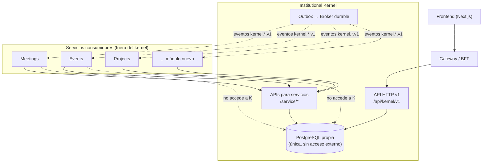
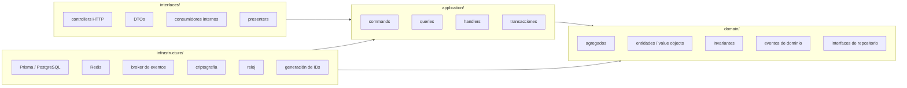
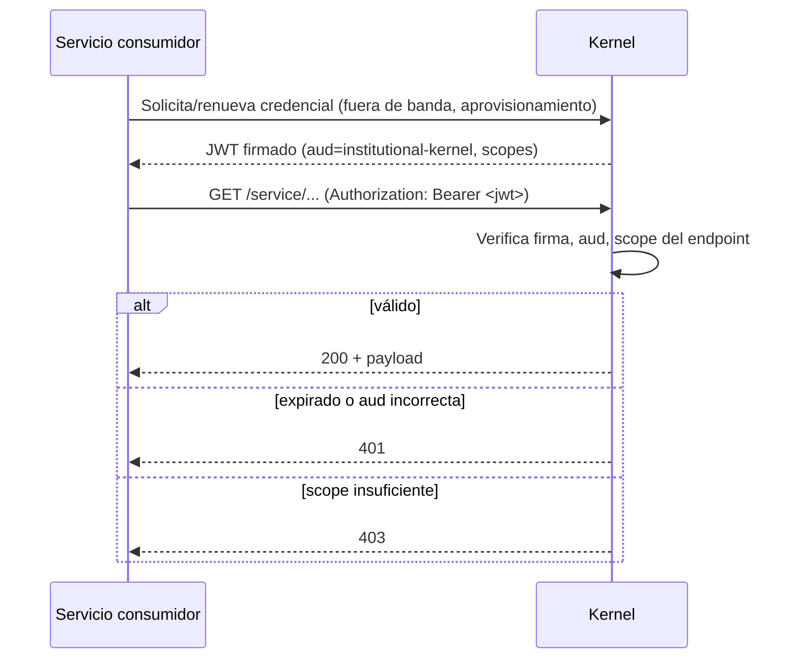

# Arquitectura — Institutional Kernel v1

**Versión:** 1.1.0
**Estado:** Documento de arquitectura derivado de `kernel-spec.md` §2, §13,
§14, §15, §16, §18, §20 y §22.
**Ámbito:** documentación pura — no contiene implementación. Ante cualquier
conflicto con `kernel-spec.md`, este documento cede.

---

## 1. Contexto

El Institutional Kernel es el núcleo independiente de la plataforma Mi
Rotaract. Responde con una única fuente de verdad quién puede
autenticarse, quién es la persona detrás de una cuenta, qué organizaciones
existen y cómo se relacionan, quién pertenece a cada una, qué períodos y
cargos están vigentes, qué permisos efectivos tiene una cuenta, y qué
módulos están habilitados por organización (`kernel-spec.md` §1). Todo lo
demás — reuniones, votaciones, eventos, proyectos, comités, oportunidades,
notificaciones, archivos, dashboards — es responsabilidad de servicios
consumidores que se integran contra el kernel, nunca al revés (§1.2).

### 1.1 Diagrama de contexto



Puntos clave del diagrama:

- Los consumidores nunca acceden a la base del kernel directamente (decisión
  final #2, §14): sólo hablan HTTP contra `/api/kernel/v1` (usuarios, vía
  gateway) o `/service/*` (servicios, vía Kernel SDK).
- El Outbox es el único canal de notificación asíncrona; no hay lectura de
  tabla compartida ni trigger cross-servicio.
- Un módulo consumidor puede no existir aún y el kernel sigue operativo
  (CA-INT-04): el diagrama no cambia si se quita cualquier caja de
  `Consumers`.

---

## 2. Principios arquitectónicos

Los diez principios de `kernel-spec.md` §2, con la consecuencia
arquitectónica que cada uno impone:

| Principio | Consecuencia en el diseño |
|---|---|
| 1. Fuente única | Ningún consumidor persiste una copia editable de un dato del kernel; sólo IDs y snapshots de solo lectura (§4 de `kernel-sdk-contract.md`). |
| 2. Sin dependencias inversas | El kernel no importa tipos, DTOs ni contratos de Meetings/Events/Projects. La dirección de dependencia es siempre consumidor → kernel. |
| 3. IDs opacos | Ningún consumidor parsea o asume estructura de un ID kernel (§6.2 de `kernel-sdk-contract.md`). |
| 4. Autorización contextual | No existe un "rol global" como mecanismo de autorización de negocio; toda decisión combina permiso + alcance (`scope`) + vigencia temporal. |
| 5. Historial antes que borrado | El modelo de datos usa máquinas de estado con estados terminales, no `DELETE`; ver §7 de `kernel-spec.md`. |
| 6. Consistencia fuerte local | Cada comando del kernel es una transacción PostgreSQL única; no hay sagas dentro del kernel mismo. |
| 7. Eventos confiables | Patrón Outbox obligatorio para todo cambio relevante (§5 de este documento). |
| 8. Contratos versionados | API HTTP y eventos versionan explícitamente (`v1`, `.v1`); ver `kernel-events-contract.md` §6. |
| 9. Denegación por defecto | El motor de autorización nunca infiere `allowed: true` por ausencia de datos. |
| 10. Extensibilidad declarativa | Los módulos se registran vía manifiesto (`ModuleDefinition.manifest`), sin tocar el código ni el esquema del kernel. |

---

## 3. Estructura interna y capas

### 3.1 Diagrama de capas



Cada módulo funcional (`identity/`, `persons/`, `organizations/`,
`memberships/`, `periods/`, `appointments/`, `authorization/`,
`applications/`, `transfers/`, `modules-registry/`) replica esta misma
estructura de cuatro capas (§13 de `kernel-spec.md`).

### 3.2 Reglas de dependencia

```text
interfaces -> application -> domain
infrastructure -> application/domain
domain -> nada externo
```

Consecuencias operativas:

- `domain/` no importa Prisma, Redis, NestJS ni ningún framework: sus tipos
  son planos y testeables sin infraestructura.
- Un controller HTTP nunca invoca un repositorio Prisma directamente; pasa
  siempre por un comando o query de `application/`.
- **Un módulo del kernel no consulta tablas ajenas directamente.** Cuando
  `appointments/` necesita saber si una membresía está `ACTIVE` (invariante
  6.6.3), lo hace a través del puerto de aplicación de `memberships/`, no
  con un `JOIN` directo a `OrganizationMembership` desde su propio
  repositorio. Esta regla es la que permite que, a futuro, módulos internos
  del kernel puedan separarse en servicios propios sin reescribir lógica de
  negocio — aunque el Kernel v1 se despliega como un único servicio
  modular (decisión final #1).

### 3.3 Paquetes compartidos

```text
packages/
  kernel-sdk/        # cliente HTTP tipado — ver kernel-sdk-contract.md
  kernel-contracts/  # schemas compartidos (OpenAPI/AsyncAPI/JSON Schema)
  auth-middleware/   # verificación de JWT de usuario y de servicio
```

Estos paquetes son el único código que un servicio consumidor debe
importar del ecosistema del kernel. No exponen tipos internos de dominio,
sólo los contratos versionados (§8 de `kernel-spec.md`, principio 8).

---

## 4. Topología de despliegue

- **Kernel v1 = un único servicio modular** (decisión final #1) con **una
  sola base PostgreSQL propia** (decisión final #2) — no hay bases por
  módulo interno todavía.
- **Redis no es fuente de verdad** (decisión final #3): es exclusivamente
  una capa de caché de lectura; si Redis cae, el kernel sigue respondiendo
  consultando PostgreSQL directamente (§15.3).
- **Broker de eventos durable, no Redis Pub/Sub** (decisión final #4): la
  entrega de eventos de integración sobrevive a una caída temporal de
  consumidores o del propio broker, porque el Outbox retiene el mensaje
  hasta confirmarse publicado.
- **Los consumidores no comparten Prisma** (decisión final #5): cada
  servicio consumidor tiene su propio esquema y su propia base; la única
  vía de acceso a datos del kernel es HTTP (`/service/*`) o eventos.
- **Los servicios externos guardan IDs y snapshots** (decisión final #6),
  nunca una réplica editable ni un `JOIN` cross-base.
- **El registro de módulos administra metadatos; no ejecuta código
  externo** (decisión final #10): instalar un módulo es una operación de
  datos (`ModuleInstallation`), no un despliegue ni una carga dinámica de
  código dentro del proceso del kernel.
- **El kernel no se modifica para agregar Meetings, Events u otros
  módulos** (decisión final #11): toda extensión pasa por el catálogo de
  módulos y por contratos versionados (decisión final #12), nunca por una
  migración o un cambio de código del kernel a pedido de un consumidor.

---

## 5. Límites de transacción y consistencia

- **Consistencia fuerte local:** cambios relacionados dentro de un mismo
  agregado (o de agregados directamente relacionados por invariante — p.
  ej. cerrar un período y finalizar sus cargos activos, invariante 6.5.7)
  se confirman en una única transacción PostgreSQL. No existe consistencia
  eventual *dentro* del kernel.
- **Consistencia eventual hacia afuera:** todo lo que un consumidor observa
  del kernel (vía eventos o snapshots) es, por diseño, una copia que puede
  estar desactualizada por el tiempo de propagación del Outbox (SLA: 99%
  en menos de 30 segundos, §18). Los flujos que no toleran ese desfase
  deben usar autorización síncrona (`checkAuthorization`), no un evento ya
  procesado.
- **Outbox como frontera de consistencia:** el comando modifica el
  agregado, incrementa `AggregateVersion` e inserta el `OutboxMessage` en
  la misma transacción (§11.4 de `kernel-spec.md`). Esto convierte "el
  cambio ocurrió" y "el cambio va a publicarse" en el mismo hecho atómico;
  nunca se puede confirmar uno sin el otro.
- **Transferencias y solicitudes son la excepción explícita
  multi-transacción:** `MembershipTransfer` (§7.7) y `MembershipApplication`
  (§7.6) modelan procesos que cruzan actores/tiempo (origen, destino,
  aceptación, confirmación) como una máquina de estados con varias
  transacciones separadas — cada transición individual es atómica, pero el
  proceso completo no lo es. El paso final (`complete`/`approve`) sí es
  atómico respecto a sus efectos colaterales (crear/reactivar membresía,
  finalizar cargos incompatibles — invariante 6.9.5-6).
- **Sin transacciones distribuidas con consumidores:** el kernel jamás
  espera un ack de un consumidor dentro de su propia transacción; hacerlo
  violaría "el kernel funciona sin consumidores" (CA-INT-04).

---

## 6. Caché y estrategia de invalidación

### 6.1 Qué se cachea (Redis)

- Jerarquía organizacional.
- Permisos efectivos por persona/organización/período.
- Autoridades actuales por organización/período.
- Período actual por organización.
- Instalaciones de módulo activas.

### 6.2 Convención de claves

```text
kernel:org-tree:{organizationId}:{version}
kernel:permissions:{personId}:{organizationId}:{periodId}:{version}
kernel:authorities:{organizationId}:{periodId}:{version}
kernel:current-period:{organizationId}:{version}
kernel:module:{organizationId}:{moduleId}:{version}
```

El sufijo `{version}` (respaldado por `AggregateVersion`, §5 del esquema)
es lo que permite invalidar por reemplazo de clave en vez de por borrado
explícito: al incrementar la versión, las lecturas nuevas fallan el caché
naturalmente y la entrada vieja expira por TTL sin necesidad de un borrado
coordinado.

### 6.3 Reglas de invalidación

Se invalida (es decir, se incrementa la versión relevante) en la misma
unidad lógica que:

- cambia una asignación de rol;
- activa o finaliza un cargo;
- cambia el estado de una membresía;
- mueve una organización en la jerarquía;
- cambia el estado de un período;
- habilita o deshabilita un módulo.

**Redis nunca es la fuente de verdad.** Si Redis no está disponible, el
kernel degrada a consultar PostgreSQL directamente — más lento, pero
correcto. Ningún flujo de escritura depende de que Redis esté arriba.

---

## 7. Jobs

Todos los jobs del kernel (§16 de `kernel-spec.md`) comparten cuatro
propiedades no negociables: usan lock distribuido (para no duplicar
trabajo entre réplicas), son idempotentes, procesan en lotes, registran
métricas, y no dependen de la disponibilidad de ningún servicio
consumidor.

| Job | Responsabilidad |
|---|---|
| `ExpirePasswordResetTokens` | Vence tokens de recuperación de contraseña no usados. |
| `ExpireEmailVerificationTokens` | Vence tokens de verificación de email no usados. |
| `ExpireAccountInvitations` | Vence invitaciones para vincular cuenta no aceptadas. |
| `ExpireMembershipApplications` | Vence solicitudes de ingreso `SUBMITTED` sin resolver. |
| `ExpireMembershipTransfers` | Vence transferencias abiertas sin completar. |
| `ActivateScheduledPeriods` | Activa períodos `SCHEDULED` cuya `startDate` (1 de julio) llegó. |
| `CloseExpiredPeriods` | Cierra períodos `ACTIVE` cuyo 30 de junio finalizó (y finaliza sus cargos, invariante 6.5.8). |
| `ActivateScheduledAppointments` | Activa cargos `ELECTED` cuyo período ya está `ACTIVE` y cuyo `startsAt` llegó. |
| `EndExpiredAppointments` | Finaliza cargos `ACTIVE` cuyo `endsAt` pasó. |
| `PublishOutboxMessages` | Worker principal de publicación de eventos (§11.4). |
| `RetryFailedOutboxMessages` | Reintenta mensajes `FAILED` con backoff. |
| `PurgeExpiredIdempotencyKeys` | Limpia `IdempotencyKey` vencidas. |
| `PurgeExpiredRevokedSessions` | Limpia `AccountSession` revocadas/vencidas. |

---

## 8. Requisitos no funcionales

Fuente: `kernel-spec.md` §18.

| Área | Objetivo v1 |
|---|---|
| Disponibilidad APIs de lectura | 99,9% mensual |
| Disponibilidad escrituras administrativas | 99,5% mensual |
| Latencia autorización p95 | < 100 ms con caché, < 300 ms sin caché |
| Latencia lectura p95 | < 300 ms |
| Publicación de eventos | 99% en menos de 30 segundos |
| RPO PostgreSQL | 15 minutos |
| RTO | 2 horas |
| Tamaño máximo batch authorization | 100 decisiones |
| Paginación por defecto | 25 |
| Paginación máxima | 100 |

Estos números son contrato para quien diseñe infraestructura (tamaño de
instancia, réplicas de lectura, configuración de backup) y para quien
consuma el SDK (timeouts recomendados en `kernel-sdk-contract.md` §6.8).

---

## 9. Arquitectura de seguridad

### 9.1 Autenticación de usuario

- Contraseñas con **Argon2id**, parámetros configurables (no fijos en
  código, para poder endurecerlos sin migración).
- **Access token:** vida útil de 10 minutos.
- **Refresh token:** rotativo, vida útil de 30 días; cada uso rota el
  token y revoca el anterior (invariante 6.1.6, CA-ID-04) — un refresh
  token robado y reutilizado después de una rotación legítima queda
  automáticamente inválido.
- Los hashes de refresh, reset y verification tokens se almacenan como
  hash, nunca en texto plano (invariante 6.1.5).
- Revocación granular por sesión (`AccountSession`), y revocación total al
  deshabilitar una cuenta (invariante 6.1.7, CA-ID-06).
- Rate limiting distribuido en endpoints de autenticación (`register`,
  `login`, `forgot-password`) para resistir fuerza bruta y enumeración.

### 9.2 Forma del access token

```json
{
  "sub": "acc_123",
  "pid": "per_123",
  "sid": "ses_123",
  "pr": "USER",
  "iss": "institutional-kernel",
  "aud": "mirotaract-platform",
  "iat": 1785320000,
  "exp": 1785320600
}
```

Deliberadamente minimalista: **no incluye todas las membresías o permisos**
(§14.2). Esa es la razón de ser de `UserContext` y de
`checkAuthorization` — el token identifica, no autoriza en detalle.

### 9.3 Autenticación servicio-a-servicio

Ver `kernel-sdk-contract.md` §2 para el contrato completo consumido por el
SDK. Resumen arquitectónico: JWT firmado o mTLS, `aud` fijo en
`institutional-kernel`, scopes técnicos por endpoint, rotación de claves.
Las rutas `/service/*` rechazan explícitamente tokens de usuario — son dos
planos de autenticación separados, no un superset uno del otro.

### 9.4 Ciclo de vida de un token de servicio



### 9.5 Autorización (dominio de negocio)

Motor contextual: persona + permiso + alcance (`scope`) + vigencia
(decisión final #9). No hay "rol global" como mecanismo de decisión de
negocio — `PlatformRole.SUPERADMIN` es la única excepción documentada, y
aun así cada decisión que resuelve queda auditada (invariante 6.7.8).
Denegación por defecto: la ausencia de una concesión válida implica acceso
denegado (principio 9); `DENY` explícito gana sobre `ALLOW` con igual o
mayor especificidad (invariante 6.7.4).

### 9.6 Auditoría

`KernelAuditLog` registra, como mínimo (§14.4): login exitoso/fallido,
cambio de email o contraseña, suspensión y reactivación de cuenta, cambios
organizacionales, cambios de membresía, cargos, asignaciones de roles,
decisiones de autorización sensibles, e instalaciones de módulos. Es
auditoría **propia del kernel** (§1.1) — no sustituye ni depende de un
sistema de auditoría de un consumidor.

### 9.7 Datos personales

Minimización como regla de diseño, no como política aparte: separación
estricta entre credencial (`UserAccount`) y perfil institucional
(`Person`); `internalNotes` de una membresía nunca se expone fuera del
kernel (tampoco en eventos, ver `kernel-events-contract.md` §4.3);
paginación y filtros obligatorios en listados; logs sin PII innecesaria.
Exportación y anonimización quedan sujetas a política posterior (§14.5) —
el Kernel v1 no las implementa todavía.

---

## 10. Observabilidad

Aunque `kernel-spec.md` no dedica una sección propia a observabilidad más
allá de mencionarla en el Definition of Done (§21: "health, métricas,
trazas y auditoría están activos"), se derivan los siguientes requisitos
de los criterios de aceptación y no funcionales existentes:

- **Health/readiness:** expuestos desde Sprint 1 (§20, Sprint 1 —
  Fundación); el kernel debe poder reportar su estado sin depender de
  ningún consumidor.
- **Métricas:** por job (§7 de este documento: "registra métricas" es
  requisito de cada job), por endpoint (para verificar los objetivos de
  latencia p95 de §8), y por publicación de Outbox (para verificar el SLA
  de 99% en 30 segundos).
- **Trazas:** `traceId`/`traceparent` se propagan end-to-end: de la
  request HTTP (§9.1) al comando (`CommandMetadata.traceId`, §8) al evento
  publicado (envelope `traceId`, ver `kernel-events-contract.md` §2.1).
  Esto permite reconstruir un flujo completo (p. ej. "activar un cargo")
  desde la llamada HTTP original hasta cada evento derivado que produjo.
- **Auditoría:** ver §9.6 — es simultáneamente un requisito de seguridad y
  de observabilidad de negocio.
- **Correlación:** `correlationId` agrupa eventos y comandos de un mismo
  flujo (ver `kernel-events-contract.md` §2.1); es la herramienta principal
  para diagnosticar un incidente que involucra varios agregados (p. ej. un
  cierre de período que finaliza cinco cargos).

---

## 11. Decisiones finales y su razonamiento

Las doce decisiones de `kernel-spec.md` §22, expandidas con el porqué:

1. **El kernel comienza como un único servicio modular.**
   Separar en microservicios desde el día uno multiplicaría la complejidad
   operativa (despliegue, observabilidad, transacciones distribuidas) sin
   que exista todavía evidencia de que un módulo interno necesite escalar
   o desplegarse independientemente. La estructura en capas y por dominio
   (§3) deja la puerta abierta a partir esto después sin reescribir lógica
   de negocio.

2. **Tiene una sola base PostgreSQL propia.**
   Consistencia fuerte local (principio 6) requiere transacciones ACID
   reales entre agregados relacionados (p. ej. cerrar un período y
   finalizar cargos). Repartir estas entidades en bases distintas
   convertiría invariantes hoy triviales en problemas de consistencia
   eventual sin necesidad real de escalar por separado.

3. **Redis no es fuente de verdad.**
   Si Redis fuera fuente de verdad, una falla de Redis sería una falla del
   kernel. Tratarlo como caché puro (con degradación a PostgreSQL, §6.3)
   significa que el peor caso de una caída de Redis es latencia más alta,
   nunca incorrección ni indisponibilidad total.

4. **Se usa broker durable, no Redis Pub/Sub.**
   Pub/Sub no retiene mensajes para consumidores desconectados: un
   servicio caído en el momento de la publicación perdería el evento para
   siempre. Un broker durable combinado con Outbox (principio 7) garantiza
   at-least-once real, que es lo que exige CA-INT-06 ("mensajes pendientes
   se publican al recuperarse el broker").

5. **Los consumidores no comparten Prisma.**
   Compartir el cliente Prisma acoplaría el esquema físico del kernel a
   cada consumidor: cualquier migración del kernel se volvería un cambio
   breaking para todos ellos simultáneamente, violando el principio de
   contratos versionados (principio 8). El único acoplamiento permitido es
   al contrato HTTP/eventos, que sí versiona explícitamente.

6. **Los servicios externos guardan IDs y snapshots.**
   Es la contraparte práctica de la decisión anterior: sin acceso a la
   base, un consumidor necesita *algo* que persistir localmente para
   operar sin latencia de red en cada request. IDs opacos (principio 3) más
   snapshots sellados (`kernel-sdk-contract.md` §4.4-4.7) le dan justo eso,
   sin crear una segunda fuente de verdad editable.

7. **Los cargos institucionales y roles técnicos son conceptos distintos.**
   Un cargo (`Appointment`) es un hecho institucional con vigencia y
   proceso propio (nominación, elección, activación); un rol técnico
   (`RoleDefinition`/`RoleAssignment`) es un mecanismo de autorización.
   Mezclarlos —como hacía el modelo anterior con flags como `isPresident`—
   obliga a que cada nuevo caso de autorización se resuelva modificando el
   modelo institucional. Separarlos permite que un cargo *derive* una
   asignación técnica (§10.3) sin que autorización y estructura
   institucional evolucionen acopladas.

8. **`Appointment` reemplaza todos los flags de presidencia.**
   Consecuencia directa de la decisión anterior, elevada a invariante
   verificable (CA-APP-03, CA-APP-04): "el presidente" nunca es una columna
   booleana en otra tabla, siempre se deriva consultando `Appointment` con
   `positionCode=CLUB_PRESIDENT` y `status=ACTIVE`. Esto elimina por
   construcción la clase de bug donde dos fuentes de verdad ("el flag" y
   "el cargo real") divergen.

9. **La autorización se basa en persona, permiso, alcance y período.**
   Un rol global ("SECRETARY") no responde a la pregunta real que hace un
   consumidor: ¿puede esta persona hacer esta acción, en esta organización,
   en este momento institucional? Modelar los cuatro ejes explícitamente
   (en vez de inferir alcance y vigencia de convención) es lo que permite
   que `ORGANIZATION_TREE` alcance clubes hijos correctamente (CA-AUTHZ-03)
   y que una asignación vencida deje de conceder acceso automáticamente
   (CA-AUTHZ-04) sin lógica ad hoc por caso de uso.

10. **El registro de módulos administra metadatos; no ejecuta código
    externo.**
    Si el kernel ejecutara código de un módulo (plugins cargados en
    proceso, por ejemplo), cualquier bug o vulnerabilidad de un módulo
    comprometería al kernel completo — justo la garantía que "el kernel
    funciona sin Meetings ni Events" (CA-INT-04) busca proteger. Tratar la
    instalación como datos puros (manifiesto + configuración validada
    contra `configurationSchema`) mantiene el radio de falla de un módulo
    contenido en el propio módulo.

11. **El kernel no se modifica para agregar Meetings, Events u otros
    módulos.**
    Es el criterio de diseño que se prueba con el "módulo ficticio" del
    Definition of Done (§21: "un módulo ficticio puede registrarse e
    instalarse sin modificar el kernel"). Si agregar un módulo real
    requiriera tocar el código del kernel, la extensibilidad declarativa
    (principio 10) sería nominal, no real.

12. **Toda extensibilidad pública empieza por contratos versionados.**
    Sin este compromiso, cualquiera de las decisiones anteriores se
    erosiona con el tiempo: es fácil que un cambio "chico" en un endpoint o
    evento rompa consumidores silenciosamente si no hay una regla explícita
    de versionado como punto de partida obligatorio. Ver
    `kernel-openapi.yaml` (prefijo `/api/kernel/v1`) y
    `kernel-events-contract.md` §6 para la aplicación concreta de esta
    decisión.

---

## 12. Orden de implementación (referencia)

El orden de implementación (§20 de `kernel-spec.md`) no es un requisito de
arquitectura en sí, pero refleja las dependencias reales entre las piezas
descritas en este documento: Fundación (Outbox, observabilidad, health)
antes que Identidad, porque todo lo demás depende de poder auditar y
publicar eventos desde el primer comando; Autorización después de
Organizaciones/Membresías/Períodos/Cargos, porque el motor de autorización
evalúa alcance y vigencia sobre esas entidades; Contratos y endurecimiento
al final, una vez que hay suficiente superficie para congelar en OpenAPI y
AsyncAPI sin necesidad de revisarla de inmediato.

| Sprint | Contenido |
|---|---|
| 1 — Fundación | Monorepo, NestJS, Prisma/PostgreSQL, contexto de comando, errores estándar, Outbox, observabilidad, health/readiness. |
| 2 — Identidad | Person, UserAccount, sesiones, login/refresh/logout, verificación y reset. |
| 3 — Organizaciones y membresías | Jerarquía, membresías, transiciones, invitaciones. |
| 4 — Períodos y cargos | Períodos, posiciones, appointments, jobs de transición. |
| 5 — Autorización | Permisos, roles, asignaciones, authorization check, caché. |
| 6 — Solicitudes y transferencias | Aplicaciones, workflow completo, transferencias atómicas. |
| 7 — Registro de módulos | Manifiestos, instalaciones, configuración, capacidades, SDK. |
| 8 — Contratos y endurecimiento | OpenAPI, AsyncAPI, contract tests, seguridad, carga, runbooks, documentación de integración. |

---

## 13. Documentos relacionados

- `institutional-governance-spec.md`: gobierno institucional, políticas,
  suplencias, incompatibilidades, elecciones, privacidad y correcciones.

- `kernel-spec.md` — especificación técnica completa (fuente normativa).
- `use-cases.md` — historias de usuario de la aplicación mi-rotaract
  actual, usadas como insumo de dominio para diseñar el kernel sin
  replicar su implementación.
- `kernel-openapi.yaml` — contrato HTTP completo de `/api/kernel/v1`.
- `kernel-events-contract.md` — catálogo completo de eventos de
  integración publicados por Outbox.
- `kernel-sdk-contract.md` — contrato del `@mirotaract/kernel-sdk` para
  servicios consumidores.
